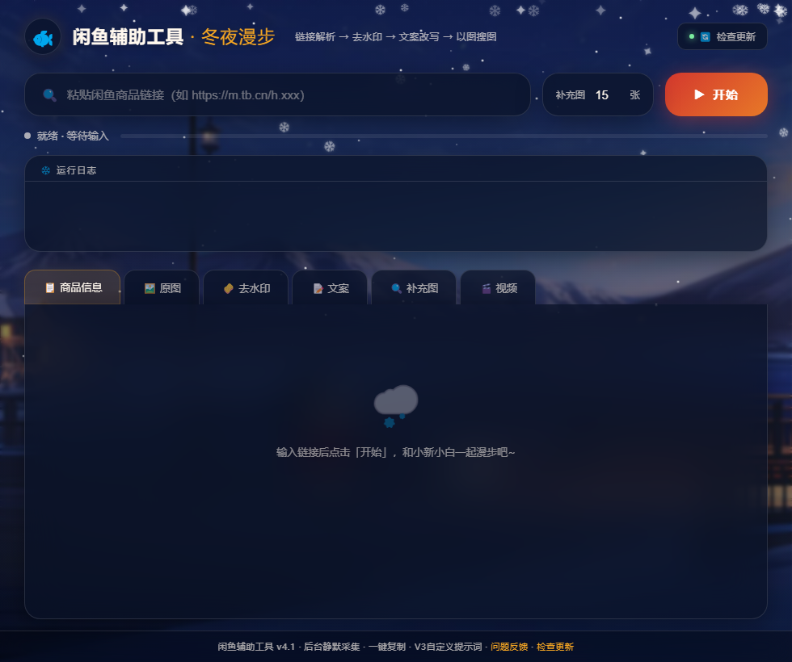

# 🐟 闲鱼辅助工具

> 闲鱼卖家效率神器 — 一键解析商品、AI去水印、智能改写文案、搜补充图

## 🎯 解决什么问题？

闲鱼卖家日常痛点：
- 🔄 多账号运营，文案不能撞车 → **一键生成3版差异化文案**
- 🖼️ 商品图有水印，盗图被封号 → **AI检测+LaMa修复，去水印无痕迹**
- 📸 图片不够9张 → **百度识图搜同类商品图，AI过滤带水印的**
- ⏱️ 手动复制粘贴太慢 → **粘贴链接，60秒全自动处理**

## ✨ 功能一览

| 模块 | 功能 | 效果 |
|------|------|------|
| 🔗 链接解析 | 粘贴闲鱼链接，自动提取标题/文案/价格/图片 | 结构化数据，比爬页面更准 |
| 🧽 AI去水印 | GLM-4V多模态检测水印位置 → LaMa修复 → 羽化贴回 | 无痕迹，保账号安全 |
| 📝 三版文案 | V1词典替换 / V2 AI微调 / V3 AI完整重写 | 3个账号3套文案，不撞车 |
| 🔍 补充图搜索 | 百度识图+GLM-4V过滤水印 | 凑齐9张图不用愁 |
| 📦 图片下载 | 并行下载商品原图 | 秒下 |

## 🖼️ 界面预览

<!-- 截图位 - 后续替换为真实运行截图 -->


> 🎨 蜡笔小新冬夜主题 — 小新陪你在闲鱼漫步

## 🚀 快速开始

### 下载安装包（推荐，零配置）

1. 👉 [前往下载](https://github.com/Qiu-Difeng/xianyu-tool/releases/latest)
2. 下载 `XianyuTool_Setup.exe`
3. 双击安装，可选安装路径
4. 桌面出现 `XianyuTool` 快捷方式，双击运行
5. 首次运行弹出Chromium窗口 → 扫码登录闲鱼
6. 以后自动复用登录，不用再扫码

> **不需要安装Python、Chrome或任何依赖，装了就能用。**

### 从源码运行

```bash
# 1. 安装依赖
pip install -r requirements.txt
python -m playwright install chromium

# 2. 配置API Key（免费申请：https://open.bigmodel.cn/）
set ZHIPUAI_API_KEY=你的API Key

# 3. 运行
python xianyu_gui.py
```

## 📋 使用流程

```
粘贴闲鱼链接 → 点「开始」→ 等60秒 → 搞定
                    ↓
        ┌──────────┼──────────┐
        ▼          ▼          ▼
   原图9张    去水印图9张   3版文案
                    ↓
            补充图（独立触发）
```

- 🔄 **V1/V2/V3各有独立刷新按钮**，每次结果不同
- 💾 **一键保存**图片和文案到自选目录
- 🎬 支持下载商品视频

## 🏗️ 技术栈

| 层 | 技术 | 说明 |
|----|------|------|
| GUI | PyWebView + WebView2 + HTML/CSS/JS | 蜡笔小新冬夜主题 |
| 浏览器 | Playwright（自带Chromium） | 独立数据目录，不碰日常浏览器 |
| 去水印 | GLM-4V-Flash + LaMa + OpenCV | AI检测+修复+羽化贴回 |
| 文案 | 智谱GLM-4-Flash | 免费不限量 |
| 打包 | PyInstaller + NSIS | 安装包，双击即装 |

## 📁 项目结构

```
├── xianyu_gui.py          # 🚪 主入口
├── gui_embed.html         # 🎨 前端界面
├── xianyu_tool.py         # ⚙️ 主流程编排
├── module1_parser.py      # 🔗 链接解析（Playwright + API拦截）
├── module3_copywriter.py  # 📝 三版文案（V1词典/V2微调/V3重写）
├── watermark_cleaner.py   # 🧽 去水印（GLM-4V + LaMa）
├── anti_detect.py         # 🛡️ 防封号（频率控制+人类行为模拟）
├── installer.nsi          # 📦 NSIS安装包脚本
└── requirements.txt       # 📋 依赖清单
```

## ❓ 常见问题

<details>
<summary><b>需要安装Chrome吗？</b></summary>
不需要。工具内置Playwright自带的Chromium，与日常浏览器完全独立。
</details>

<details>
<summary><b>需要安装Python吗？</b></summary>
下载exe版不需要。从源码运行需要Python 3.8+。
</details>

<details>
<summary><b>首次扫码登录安全吗？</b></summary>
安全。登录数据保存在本地 `%LOCALAPPDATA%\XianyuTool_ChromeData`，不会上传任何地方。
</details>

<details>
<summary><b>API Key怎么申请？</b></summary>
智谱AI开放平台（https://open.bigmodel.cn/）免费注册即可，GLM-4-Flash和GLM-4V-Flash都是免费不限量的。
</details>

<details>
<summary><b>去水印效果怎么样？</b></summary>
GLM-4V多模态AI定位水印区域 → LaMa图像修复算法填补 → 12px羽化贴回保证边缘过渡自然。无水印图片自动跳过（1秒完成）。
</details>

## ⚠️ 免责声明

本工具仅供学习交流使用。使用者需遵守闲鱼平台规则，对使用本工具产生的任何后果自行负责。

## 📄 License

MIT License - 可自由使用、修改、分发

---

<div align="center">

**如果这个工具帮到了你，点个 ⭐ Star 支持一下！**

[下载安装包](https://github.com/Qiu-Difeng/xianyu-tool/releases/latest) · [报告问题](https://github.com/Qiu-Difeng/xianyu-tool/issues) · [查看源码](https://github.com/Qiu-Difeng/xianyu-tool)

</div>
